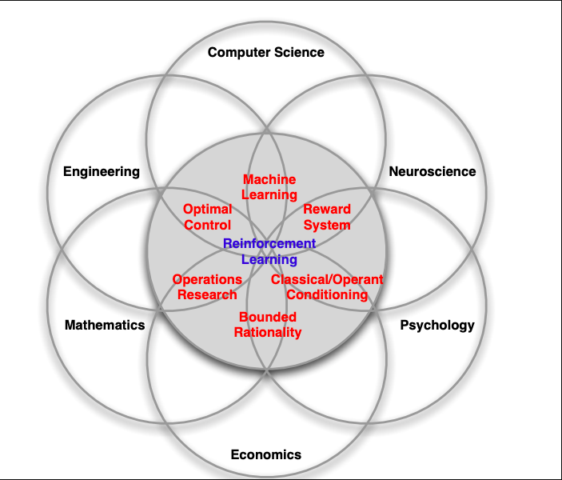
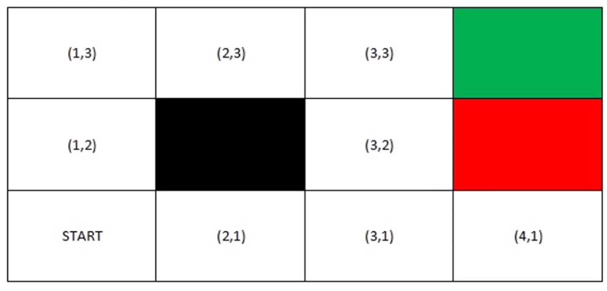
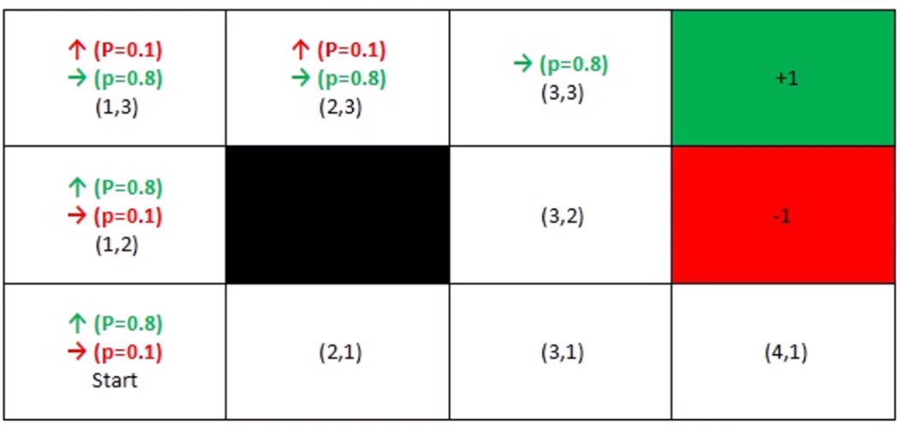

### psa summarized
- #### trial & error, learning from consequences, optimal strategy(policy), agent, environment, action, state, reward,
- #### application of RL 
    - 
- #### grid world
    - 
- #### stochastic grid world
    - Grid world with Probability
    - 
    - uncertainty
- #### Exploration & Exploitation 
    - agent အနေနဲ့ အောက်က နှစ်ခုထဲက တခု လုပ်ဖို့လိုတယ်။
    - ရှာဖွေခြင်း action အသစ်ပြုလုပ်ခြင်း ( exploration ) ( ဘီယာဆိုင် အသစ်ရှာဖွေခြင်း )
    - ရှိပြီးသား resource က နေ knowledge ရယူခြင်း ( Exploitation ) ( သိပြီးသား Beer ဆိုင်များမှ ရယူခြင်း )
    - နှစ်ခုလုံးမျှတနေတာက ပိုကောင်းပါတယ်။ အဲ့ဒီအတွက် နည်းလမ်းအမျိုးမျိုးရှိပါတယ်။ 
- #### NN & RL
    - 1.Estimate Q Value from QFunction ( Agent ဟာ reward ရဖို့ ဘယ်လို state မှာ action ယူရမလဲ? )
        - Deep Neural Network <-- Q Function
        - Deep Q Learning ( DQN )
    - 2.Recognize Agent's State from High Dimensional Inputs
        - Inputs ဟာ Complex ဖြစ်တာမို့ CNN ကို သုံးမယ်။
        - အသုံးဝင်တဲ့ features တွေကို CNN က ရယူမယ်။
        - အဲ့ဒီကနေ RL ရဲ့ state representations ဖြစ်လာမှာပေါ့။
    - 3.Policy Network
        - Policy based Methods ( လက်ရှိ State ကို အခြေခံပြီးတော့ ဘယ်လိုမျိုး Action ယူမလဲ။ )
        - Reinforce, PPO (A3C Algorithm), ...
- #### OpenAI Gym ( Python module အဟောင်း )
    - reinforcement learning framework
    - git clone https://github.com/openai/gym && cd gym
    - source rl_venv
    - pip install spyder-kernels==3.1.
    - pip install gym[classic_control] or pip install pygame
    - pip install -e .
    - [[ rl1.py ]](./rl1.py)
    - module အသစ် က https://github.com/Farama-Foundation/Gymnasium
- #### BURLAP ( java )
    - java ထည့် , maven ထည့်, apache maven bin path ကို $PATH ထဲထည့်
    - လိုမှ install လုပ်ပါ။
- #### Summary
    - environment နဲ့ interaction လုပ်တဲ့ process
    