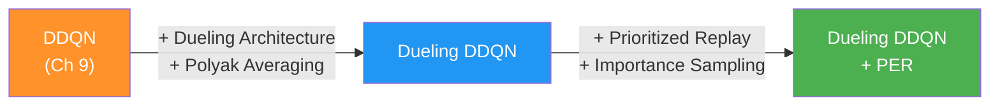
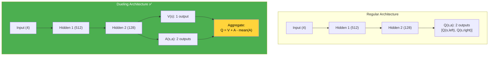
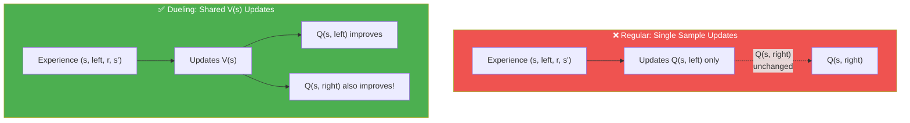
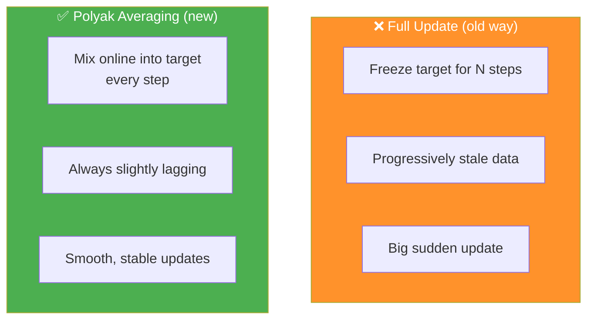
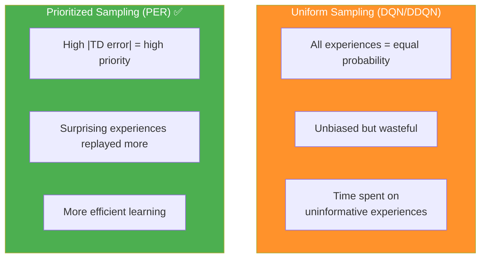
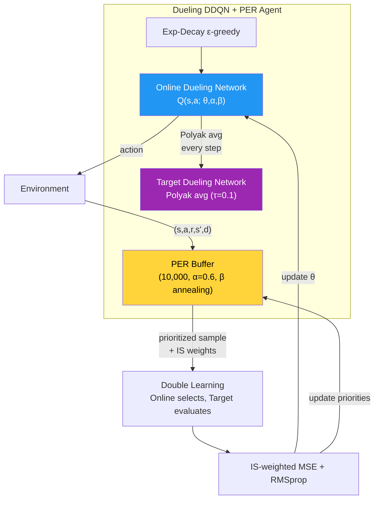
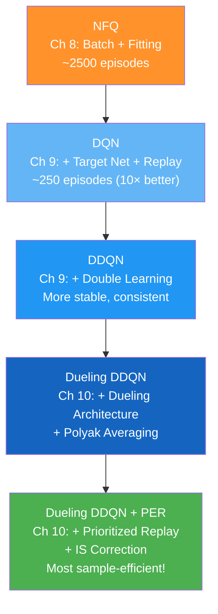
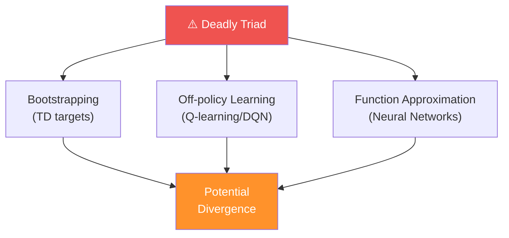

# Chapter 10: Sample-Efficient Value-Based Methods - အကျဉ်းချုပ်

## 1. Chapter ရဲ့ ရည်ရွယ်ချက်

ဒီ Chapter မှာ value-based DRL ရဲ့ **sample efficiency** ကို ပိုကောင်းအောင် improvements ၂ ခု ထပ်ထည့်ပါတယ်: **Dueling Architecture** နှင့် **Prioritized Experience Replay (PER)**။



အဓိက အကြောင်းအရာများ:
1. **Dueling network** — Q(s,a) ကို V(s) + A(s,a) ခွဲပြီး learn
2. **Polyak averaging** — smooth target network updates
3. **Prioritized Experience Replay** — TD error ဖြင့် priority sampling
4. **Importance sampling** — prioritization bias ကို correct
5. **Value-based DRL ရဲ့ evolution** — NFQ → DQN → DDQN → Dueling DDQN → PER

---

## 2. Value Functions ရဲ့ Relationship

### Q, V, A Functions

$$Q(s, a) = V(s) + A(s, a)$$

| Function | Meaning | Output |
|---|---|---|
| **Q(s, a)** | State-action value | Action ရဲ့ expected return |
| **V(s)** | State value | State ရဲ့ expected return (avearge over actions) |
| **A(s, a)** | Advantage | Action a က average ထက် ဘယ်လောက် better/worse |

$$A(s, a) = Q(s, a) - V(s)$$

$$\mathbb{E}_{a \sim \pi}[A(s, a)] = 0$$

> 💡 Advantage function ရဲ့ expectation က **0** ဖြစ်ပါတယ်။ Policy ရဲ့ default action ကို ယူရတာ (**V(s)**)ထက် action a က ဘယ်လောက် better/worse ဆိုတာ ပြပါတယ်။

---

## 3. Dueling Network Architecture

### Regular vs Dueling Architecture



### ဘာကြောင့် Dueling Architecture ပိုကောင်းတာလဲ

**Regular network** — Q(s, left) နဲ့ Q(s, right) ကို separately learn ရတယ်:
- Sample တစ်ခုက action တစ်ခုရဲ့ Q-value ကိုသာ update

**Dueling network** — V(s) ကို share ပြီး A(s,a) ရဲ့ differences သာ learn:
- Sample တစ်ခုက **V(s) ကို update** → **all actions** ရဲ့ Q-values improve!
- **Sample efficiency** dramatically improve



### Cart-Pole Example

Pole upright position (perfect state) → left/right values nearly equal:
- $Q(s, \text{left}) \approx Q(s, \text{right})$
- $V(s)$ ≈ high, $A(s, \text{left}) \approx A(s, \text{right}) \approx 0$

Pole tilted right:
- $A(s, \text{right}) > 0$ (push right → correct tilt)
- $A(s, \text{left}) < 0$ (push left → worsen tilt)

---

## 4. FCDuelingQ: PyTorch Implementation

### Building the Dueling Network

```python
class FCDuelingQ(nn.Module):
    def __init__(self, input_dim, output_dim,
                 hidden_dims=(32, 32), activation_fc=F.relu):
        super(FCDuelingQ, self).__init__()
        self.activation_fc = activation_fc
        
        # Shared layers
        self.input_layer = nn.Linear(input_dim, hidden_dims[0])
        self.hidden_layers = nn.ModuleList()
        for i in range(len(hidden_dims) - 1):
            self.hidden_layers.append(
                nn.Linear(hidden_dims[i], hidden_dims[i+1]))
        
        # Two separate output streams
        self.value_output = nn.Linear(hidden_dims[-1], 1)       # V(s): single value
        self.advantage_output = nn.Linear(hidden_dims[-1], output_dim)  # A(s,a): per action
```

### Aggregating Equation (Forward Pass)

$$Q(s, a; \theta, \alpha, \beta) = V(s; \theta, \beta) + \left( A(s, a; \theta, \alpha) - \frac{1}{|\mathcal{A}|}\sum_{a'} A(s, a'; \theta, \alpha) \right)$$

- $\theta$ — shared layer weights
- $\alpha$ — advantage stream weights
- $\beta$ — value stream weights

```python
def forward(self, state):
    x = state
    if not isinstance(x, torch.Tensor):
        x = torch.tensor(x, device=self.device, dtype=torch.float32)
        x = x.unsqueeze(0)
    
    x = self.activation_fc(self.input_layer(x))
    for hidden_layer in self.hidden_layers:
        x = self.activation_fc(hidden_layer(x))
    
    a = self.advantage_output(x)          # A(s, a)
    v = self.value_output(x).expand_as(a) # V(s) → expand to match A shape
    
    # Aggregation: Q = V + (A - mean(A))
    q = v + a - a.mean(1, keepdim=True).expand_as(a)
    return q
```

> ⚠️ V(s) နဲ့ A(s,a) ကို uniquely recover မလုပ်နိုင်ပါ (V+10 နဲ့ A-10 ဆိုရင် Q အတူတူ ရနိုင်)။ **mean(A) ကို subtract** လုပ်ခြင်းဖြင့် one degree of freedom ကို ဖယ်ပြီး optimization စိတ်ချရ stabilize ဖြစ်အောင် ပြုလုပ်ပါတယ်။

---

## 5. Polyak Averaging — Smooth Target Updates

### Full Update vs Polyak Averaging



### Formula

$$\theta^- \leftarrow (1 - \tau) \cdot \theta^- + \tau \cdot \theta$$

- $\tau = 0.1$ → target network = 90% old + 10% new (every step)
- $\tau = 1.0$ → full copy (equivalent to old method)

### Implementation

```python
def update_network(self, tau=None):
    tau = self.tau if tau is None else tau
    for target, online in zip(
        self.target_model.parameters(),
        self.online_model.parameters()):
        target_ratio = (1.0 - tau) * target.data    # 90% target
        online_ratio = tau * online.data              # 10% online
        mixed_weights = target_ratio + online_ratio
        target.data.copy_(mixed_weights)
```

| Update Method | Pros | Cons |
|---|---|---|
| **Full update** (every N steps) | Simple | Stale data between updates, sudden big change |
| **Polyak averaging** (every step) | Smooth, always recent | Need to tune τ |

---

## 6. Prioritized Experience Replay (PER)

### Uniform vs Prioritized Sampling



### TD Error as Priority

$$\text{priority}_i = |\delta_i| = |Q(s_i, a_i; \theta) - y_i|$$

> 💡 High reward ဟုတ်ရင်သာ replay လုပ်ဖို့ ကြိုးစားတာ **မှားပါ**တယ်! Agent ကို high/low/mundane experiences **အားလုံး** ကနေ learn ခိုင်းရမယ်။ **Surprise (TD error)** ကသာ learning opportunity ရဲ့ best proxy ဖြစ်ပါတယ်။

### Greedy Prioritization ရဲ့ Problems

1. TD error = 0 ဖြစ်ရင် → replay ထပ်မဖြစ်နိုင်
2. Function approximators ကြောင့် errors နှေးနှေး shrink → small subset ပေါ်မှာ fixate
3. TD errors are noisy → noise follow ဖြစ်နိုင်

**ဖြေရှင်းချက်**: Stochastic prioritization (greedy မဟုတ်ဘဲ probability-based sampling)

---

## 7. Proportional vs Rank-based Prioritization

### Proportional Prioritization

$$p_i = |\delta_i| + \epsilon$$

- $\epsilon$ — small constant (zero TD error ဖြစ်ရင်လည်း replay ဖြစ်ဖို့)

### Rank-based Prioritization

$$p_i = \frac{1}{\text{rank}(i)}$$

- rank = position when sorted by |TD error| (descending)
- Outlier-resistant (proportional ထက် robust)

### Priorities → Probabilities

$$P(i) = \frac{p_i^\alpha}{\sum_k p_k^\alpha}$$

- $\alpha = 0$: **Uniform** sampling (all equal)
- $\alpha = 1$: **Full prioritization** (proportional to TD error)
- $0 < \alpha < 1$: **Blend** between uniform and prioritized


---

## 8. Importance Sampling — Bias Correction

### ဘာကြောင့် Correction လိုသလဲ

Prioritized sampling ဟာ data distribution ကို ပြောင်းလိုက်ပါတယ်:
- High-priority experiences: over-sampled
- Low-priority experiences: under-sampled
- **Biased estimates** ဖြစ်နိုင် (convergence ကို harm)

### Importance Sampling Weights

$$w_i = \left(\frac{1}{N \cdot P(i)}\right)^\beta$$

$$\hat{w}_i = \frac{w_i}{\max_j w_j}$$

- $\beta = 0$: **No correction** (ignoring bias)
- $\beta = 1$: **Full correction** (completely unbiased)
- $\beta$ ကို 0.1 ကနေ 1.0 ဆီ slowly anneal

> 💡 Max weight ဖြင့် normalize ခြင်းကြောင့် **largest weight = 1** ဖြစ်ပြီး TD errors ကို downscale only (upscale မဖြစ်) → training stability maintain

### Loss Function with IS Weights

$$\mathcal{L}(\theta) = \frac{1}{N}\sum_{i=1}^{N} \hat{w}_i \cdot (Q(s_i, a_i; \theta) - y_i)^2$$

```python
# PER loss function
td_error = q_sa - target_q_sa
value_loss = (weights * td_error).pow(2).mul(0.5).mean()  # weights = IS weights

# Update priorities after training
priorities = np.abs(td_error.detach().cpu().numpy())
self.replay_buffer.update(idxs, priorities)
```

---

## 9. PER Buffer Implementation

```python
class PrioritizedReplayBuffer():
    def store(self, sample):
        # New experience → max priority (ensure replayed at least once)
        priority = 1.0
        if self.n_entries > 0:
            priority = self.memory[:self.n_entries, self.td_error_index].max()
        self.memory[self.next_index, self.td_error_index] = priority
        self.memory[self.next_index, self.sample_index] = np.array(sample)
        self.n_entries = min(self.n_entries + 1, self.max_samples)
        self.next_index = (self.next_index + 1) % self.max_samples
    
    def update(self, idxs, td_errors):
        # Update TD errors for replayed experiences
        self.memory[idxs, self.td_error_index] = np.abs(td_errors)
    
    def sample(self, batch_size=None):
        # Calculate priorities
        if self.rank_based:
            priorities = 1 / (np.arange(self.n_entries) + 1)
        else:  # proportional
            priorities = entries[:, self.td_error_index] + EPS
        
        # Priorities → Probabilities
        scaled_priorities = priorities ** self.alpha
        probs = scaled_priorities / np.sum(scaled_priorities)
        
        # Importance sampling weights
        weights = (self.n_entries * probs) ** (-self.beta)
        normalized_weights = weights / weights.max()
        
        # Sample using probabilities
        idxs = np.random.choice(self.n_entries, batch_size,
                                replace=False, p=probs)
        return idxs, normalized_weights[idxs], samples
```

---

## 10. Full Dueling DDQN + PER Algorithm

### Architecture & Hyperparameters



### Hyperparameters Summary

| Parameter | Value |
|---|---|
| Architecture | Dueling (4, 512, 128, [1; 2], 2) |
| Objective | Approximate $q^*(s,a)$ |
| Learning rate | 0.0007 (RMSprop) |
| Target update | Polyak averaging (τ=0.1, every step) |
| Exploration | Exp-decay ε-greedy (1.0 → 0.3) |
| Loss | IS-weighted MSE (grad clip = ∞) |
| Double learning | ✅ |
| Buffer capacity | 10,000 |
| Batch size | 64 |
| PER α | 0.6 (degree of prioritization) |
| PER β | 0.1 → 1.0 (anneal rate 0.99992, ~30k steps) |

### Algorithm Steps

1. **Collect** experience → insert with **max priority** into PER buffer
2. **Sample** mini-batch using **priority probabilities** + **IS weights**
3. **Calculate** TD targets using **double learning** (online selects, target evaluates)
4. **Fit** Q-network with **IS-weighted MSE** + RMSprop
5. **Update** priorities of replayed experiences with new |TD errors|
6. **Polyak update** target network every step

---

## 11. Value-Based DRL Evolution Summary



### Method Comparison

| Method | Key Addition | Sample Efficiency | Stability |
|---|---|---|---|
| **NFQ** | Batch fitting | ⭐ | ⭐ |
| **DQN** | Target net + Replay | ⭐⭐⭐ | ⭐⭐ |
| **DDQN** | Double learning | ⭐⭐⭐ | ⭐⭐⭐ |
| **Dueling DDQN** | V+A architecture + Polyak | ⭐⭐⭐⭐ | ⭐⭐⭐⭐ |
| **+ PER** | Priority sampling + IS | ⭐⭐⭐⭐⭐ | ⭐⭐⭐⭐ |

### Value-Based DRL ရဲ့ Known Issues ("Deadly Triad")



**Practical advice:**
- Target networks + replay buffers + double learning သုံး
- Sufficiently small learning rates (but not too small)
- Patience 🙂

---

## 12. Key Equations Summary

| Equation | Formula |
|---|---|
| **Q decomposition** | $Q(s,a) = V(s) + A(s,a)$ |
| **Dueling aggregation** | $Q = V + A - \frac{1}{|\mathcal{A}|}\sum_{a'} A(s,a')$ |
| **Polyak averaging** | $\theta^- \leftarrow (1-\tau)\theta^- + \tau\theta$ |
| **Proportional priority** | $p_i = |\delta_i| + \epsilon$ |
| **Rank-based priority** | $p_i = \frac{1}{\text{rank}(i)}$ |
| **Priority → Probability** | $P(i) = \frac{p_i^\alpha}{\sum_k p_k^\alpha}$ |
| **IS weights** | $w_i = (N \cdot P(i))^{-\beta}$ |
| **IS-weighted loss** | $\mathcal{L} = \frac{1}{N}\sum_i \hat{w}_i (Q(s_i,a_i;\theta) - y_i)^2$ |

---

## 13. နိဂုံးချုပ် (Conclusion)

ဒီ Chapter မှာ သင်ယူခဲ့တဲ့ အဓိက takeaways:

1. **Dueling architecture** — Q(s,a) ကို V(s) + A(s,a) ခွဲပြီး learn ခြင်းဖြင့် sample efficiency ပိုကောင်း
2. **V(s) sharing** — single experience tuple က all actions ရဲ့ values ကို improve
3. **Aggregation trick** — mean(A) subtract ဖြင့် V, A uniquely recover ရအောင်
4. **Polyak averaging** — full copy update အစား smooth mixing (τ=0.1) every step
5. **PER** — TD error-based priority ဖြင့် informative experiences ကို ပိုမို replay
6. **Proportional vs Rank-based** — two strategies for calculating priorities
7. **Importance sampling** — prioritized sampling ရဲ့ bias ကို β-annealing ဖြင့် correct
8. **Deadly triad** — bootstrapping + off-policy + function approximation = divergence risk

> 💡 Chapters 8-10 သည် **value-based DRL** ရဲ့ complete survey ဖြစ်ပါတယ်။ NFQ → DQN → DDQN → Dueling DDQN → PER ဟု evolution ပြုလုပ်ခဲ့ပြီး ဒီ improvements အားလုံးသည် **Lego blocks** ကဲ့သို့ plug-and-play ပြုလုပ်နိုင်ပါတယ်။
